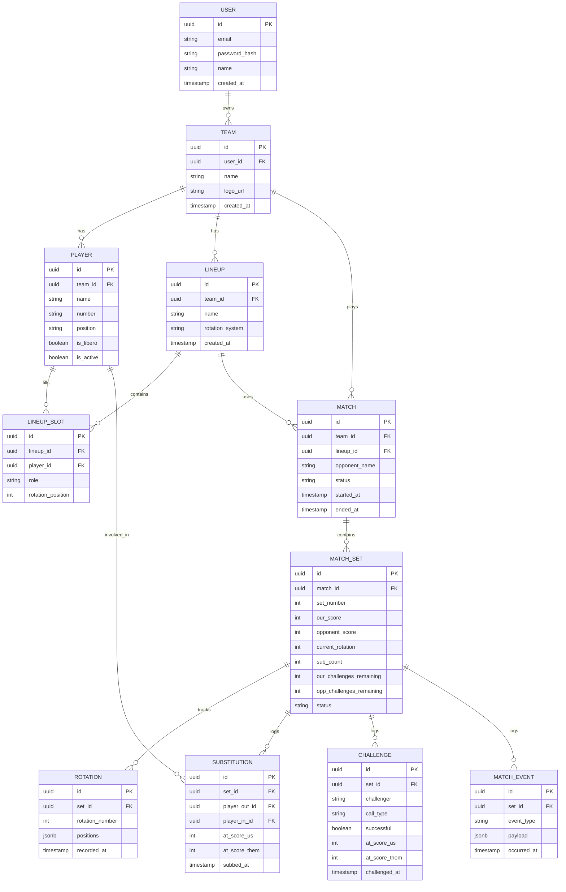

# VolleyBrain — Entity Relationship Diagram

```mermaid
erDiagram
  USER ||--o{ TEAM : owns
  TEAM ||--o{ PLAYER : has
  TEAM ||--o{ LINEUP : has
  LINEUP ||--o{ LINEUP_SLOT : contains
  PLAYER ||--o{ LINEUP_SLOT : fills
  TEAM ||--o{ MATCH : plays
  LINEUP ||--o{ MATCH : uses
  MATCH ||--o{ MATCH_SET : contains
  MATCH_SET ||--o{ ROTATION : tracks
  MATCH_SET ||--o{ SUBSTITUTION : logs
  MATCH_SET ||--o{ CHALLENGE : logs
  MATCH_SET ||--o{ MATCH_EVENT : logs
  PLAYER ||--o{ SUBSTITUTION : involved_in

  USER {
    uuid id PK
    string email
    string password_hash
    string name
    timestamp created_at
  }
  TEAM {
    uuid id PK
    uuid user_id FK
    string name
    string logo_url
    timestamp created_at
  }
  PLAYER {
    uuid id PK
    uuid team_id FK
    string name
    string number
    string position
    boolean is_libero
    boolean is_active
  }
  LINEUP {
    uuid id PK
    uuid team_id FK
    string name
    string rotation_system
    timestamp created_at
  }
  LINEUP_SLOT {
    uuid id PK
    uuid lineup_id FK
    uuid player_id FK
    string role
    int rotation_position
  }
  MATCH {
    uuid id PK
    uuid team_id FK
    uuid lineup_id FK
    string opponent_name
    string status
    timestamp started_at
    timestamp ended_at
  }
  MATCH_SET {
    uuid id PK
    uuid match_id FK
    int set_number
    int our_score
    int opponent_score
    int current_rotation
    int sub_count
    int our_challenges_remaining
    int opp_challenges_remaining
    string status
  }
  ROTATION {
    uuid id PK
    uuid set_id FK
    int rotation_number
    jsonb positions
    timestamp recorded_at
  }
  SUBSTITUTION {
    uuid id PK
    uuid set_id FK
    uuid player_out_id FK
    uuid player_in_id FK
    int at_score_us
    int at_score_them
    timestamp subbed_at
  }
  CHALLENGE {
    uuid id PK
    uuid set_id FK
    string challenger
    string call_type
    boolean successful
    int at_score_us
    int at_score_them
    timestamp challenged_at
  }
  MATCH_EVENT {
    uuid id PK
    uuid set_id FK
    string event_type
    jsonb payload
    timestamp occurred_at
  }
```